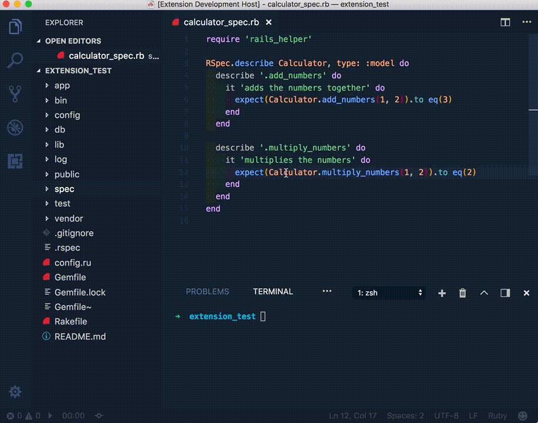
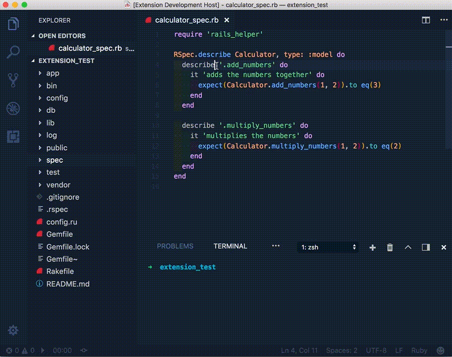

# Rails Test Runner README

Run your rails tests smoothly from within Visual Studio Code

## Quickly run your tests


## Run them through menus as well


## Project goal
To allow users to easily and quickly run either individual tests
or the whole test suite in a rails project no matter if they use
minitest, rspec or cucumber.

## Features
The extension currently only supports rspec but should eventually
support the most popular test runners.

## Configuration
### railsTestRunner.rspecCommand
Configures what command will be used to execute the tests

* Type: `string`
* Default: `bundle exec rspec`

### railsTestRunner.clearTerminal
If set to true (default) the terminal will be cleared on each new run.

* Type: `boolean`
* Default: true

### railsTestRunner.focusTerminal
If set to true (default) the terminal will be focused when a test run is being initiated

* Type: `boolean`
* Default: true


### railsTestRunner.railsTestRunner.rspec.failFast
If set to true rspec will be run with --fail-fast meaning that execution will stop after
first failed test is encountered (great to use in combination with running only failed tests)

* Type: `boolean`
* Default: false

## Features
The extension currently only supports rspec but should eventually
support the most popular test runners.

### Run all tests in the currently opened file
cmd-shift-p `railsTestRunner.runAllTestsInFile`

Or select the option via the context menu

### Run tests on current line
cmd-shift-p `railsTestRunner.runTestAtLine`

Or select the option via the context menu

### Run last test(s)
cmd-shift-p `railsTestRunner.runLastTests`

### Run all tests in current folder
Right click on folder in explorer menu and select `Rails Test Runner: Run all tests in folder`

### Run all tests
cmd-shift-p `railsTestRunner.runAllTests`

### Run only failing tests
For this to work you need to also configure your rspec setup to support
saving the last failures to a text file. Please take a look at: https://relishapp.com/rspec/rspec-core/docs/command-line/only-failures

After that is done simply run the command and you should only be running failed tests.
cmd-shift-p `railsTestRunner.runLastFailedTests`

## Keybindings
To change your keyboard shortcuts, paste the rules in `Code -> Preferences -> Keyboard Shortcuts -> keybindings.json`:

```json
{
  "key": "cmd+shift+f",
  "command": "railsTestRunner.runAllTestsInFile"
},
{
    "key": "cmd+shift+l",
    "command": "railsTestRunner.runTestAtLine"
},
{
    "key": "cmd+shift+y",
    "command": "railsTestRunner.runLastTests"
},
{
    "key": "cmd+shift+r",
    "command": "railsTestRunner.runLastFailedTests"
},

```

### Todo
- [x] Support rspec
- [ ] Support minitest
- [ ] Support cucumber
